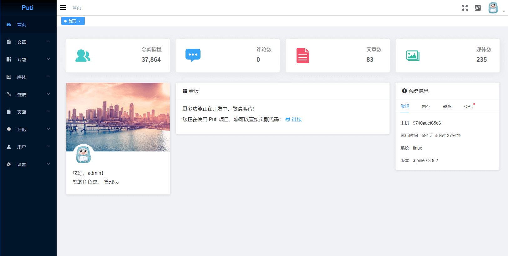

<p align="center">
    
</p>
<h1 align="center">Puti</h1>
<p align="center">
    <em>:black_nib:Puti is a blog system written in Golang.</em>
</p>
<p align="center">
    <a href="https://circleci.com/gh/puti-projects/puti">
        
    </a>
    <a href="https://goreportcard.com/report/github.com/puti-projects/puti">
        
    </a>
    <a href="https://app.fossa.io/projects/git%2Bgithub.com%2Fputi-projects%2Fputi?ref=badge_shield">
        
    </a>
    <a href="https://github.com/puti-projects/puti/releases">
        
    </a>
    <a href="https://github.com/puti-projects/puti/blob/master/LICENSE">
        
    </a>
</p>
<p align="center">
<a href="https://github.com/puti-projects/puti/blob/master/README.md">中文</a>
 | Engilsh
</p>


## Project Status
This project is still developing. Because it is the first project of the author to contact the Go language, the quality of the code is not in place and will be optimized in the future. Your contribution is very welcome. Also, for these terrible English translations, welcome to improve.

## Environmental requirements
 - Golang 1.11+ (Build using modules)
 - MySQL 
 - Nginx (Optional)
  
Golang version 1.11 supports go module, and this project uses go module; Nginx is optional.

## Features
The project plan implementation and the functions that have been implemented are as follows:
* [ ] Features
  * [ ] Loign and register
    * [x] Loign
    * [ ] Register
    * [ ] Third party access (github, etc.)
  * [x] Article
  * [x] Page
  * [x] Category
  * [x] Tag
  * [x] Subject
  * [ ] Link
  * [x] Media
  * [x] User
  * [ ] Comments
  * [ ] Settings
    * [x] Normal setting
    * [ ] Third party settings (GitHub, WeChat, etc.)
  * [ ] Frontend theme
    * [X] Theme support
    * [X] Default theme (Emma)
    * [ ] Free switching 
  * [ ] Plugin
    * [ ] Plugin support
    * [ ] Plugin management (upload, delete, etc.)
  * [ ] Email
    * [ ] Mail configuration
    * [ ] Mail delivery
* [ ] Technical Support 
  * [ ] Complete i18n support
  * [ ] Mail service configuration
  * [ ] Toc support (not theme)
  * [ ] Configure image cropping
  * [X] HTTPS
  * [x] WebService forwarding
  * [ ] Avatar access
  * [ ] OAuth 
  * [ ] Media file cloud storage (for CDN)
* [ ] Ecology
  * [x] Docker image support
  * [x] Configured automatic deployment script  
  * [ ] Simple statistical system

## Screenshot



## Getting Started

### Configuration
Puti's configuration file is `config.yaml` under path `configs`, and the configuration file can be initialized from `config.yaml.example` when first used.   
Configuration to be aware of：   

| Configuration | Description |
| :----- | :----- | 
| addr | HTTP Port |
| jwt_secret |  Json web token secret key |
| tls.https_open |  Open HTTPS  |
| tls.addr |  HTTPS Port  |
| tls.cert | SSL certificate path   |
| tls.key |  SSL private key path  |
| db.name |  Database name  |
| db.addr |  Database HOST:PORT  |
| db.username |  Database user  |
| db.password |  Database password |


### Installation
#### Source installation
The source installation requires that the system has the required version of the Go language installed, as Go 1.11 and above is recommended, so we are not concerned about the GOPATH issue.    
In view of certain factors, in order to have a better package download experience, the Vendor directory has been built into the project and managed with the go module.
```
# Download
$ go get -u github.com/puti-projects/puti

# Use Makefile to build programs
$ cd $GOPATH/src/github.com/puti-projects/puti
$ make
```

#### Using Docker
##### Using Ready-made Docker Images
We have provided a ready-made image that can be pulled directly:
```sh
# Pull image from Docker Hub.
$ docker pull puti/puti

# Create local directory for volume.
$ mkdir -p /data/puti /data/logs/puti

# Use `docker run` for the first time.
$ docker run --name=puti -p 80:8000 -p 443:8080 -v /data/puti:/data/puti -v /data/logs/puti:/data/logs/puti puti/puti

# Use `docker start` if you have stopped it.
$ docker stop puti
$ docker start puti
```
More information：[Docker use](./script/docker.README.md)

##### Use configurable deployment script
We provide a one-click deployment of the Docker-compose script file, which is convenience for build the working environment. [puti-projects/puti-environment](https://github.com/puti-projects/puti-environment)

### Usage

## Theme
More themes is creating. The default theme Emma is currently available.

## Documentation
TODO

## Changelog
Detailed changes for each release are documented in the [changelog file]((https://github.com/axetroy/vscode-gpm/blob/master/CHANGELOG.md)).

## Dependencies
Thanks for these great open source libraries:
| Dependency | About |
| :----- | :----- | 
| [gin-gonic/gin](https://github.com/gin-gonic/gin) |  HTTP web framework written in Go |
| [jinzhu/gorm](https://github.com/jinzhu/gorm) | The ORM library for Golang|
| [vuejs/vue](https://github.com/vuejs/vue) | JavaScript framework for building UI on the web |
| [ElemeFE/element](https://github.com/ElemeFE/element) | A Vue.js 2.0 UI Toolkit for Web  |
| [PanJiaChen/vue-element-admin](https://github.com/PanJiaChen/vue-element-admin) | A front-end management background integration solution |

## Q & A


## Authors
Puti is a project by 
- Goozp ([@goozp](https://www.goozp.com))

## Contributors
<!-- ALL-CONTRIBUTORS-LIST:START - Do not remove or modify this section -->
| [<br /><sub>goozp</sub>](https://www.goozp.com)<br />[💻](https://github.com/puti-projects/puti/commits?author=goozp "Code commitor")[📚](https://github.com/dawnlabs/carbon/commits?author=briandennis "Documentation")[🎨](#design "Design") | 
| :---: |

<!-- ALL-CONTRIBUTORS-LIST:END -->

## License
[](https://app.fossa.io/projects/git%2Bgithub.com%2Fputi-projects%2Fputi?ref=badge_large)